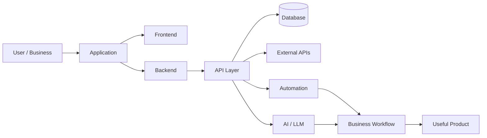

<!-- ========================================================= -->
<!--                     ZOHAIB ALI PROFILE                      -->
<!-- ========================================================= -->

<div align="center">


<br/>

<a href="https://git.io/typing-svg">

</a>

<br/>


<br/><br/>

`FULL-STACK DEVELOPMENT` • `AI INTEGRATION` • `AUTOMATION` • `SYSTEM DESIGN`

</div>

---

## 👋 About Me

I'm **Zohaib Ali**, a Full-Stack Developer currently working at **Parix.ai**.

I work across frontend, backend, APIs, databases, integrations, and modern AI-enabled systems. My focus is on building software that is not only functional, but also **maintainable, scalable, reliable, and useful in real-world business environments**.

I enjoy working on systems where different parts of software need to work together — user interfaces, backend services, databases, APIs, automation workflows, and AI capabilities.

```javascript
const zohaib = {
    role: "Full-Stack Developer",
    company: "Parix.ai",

    education: {
        degree: "BS Computer Science",
        university: "University of Sindh"
    },

    focus: [
        "Full-Stack Development",
        "Backend Architecture",
        "API Integrations",
        "AI Automation",
        "Scalable Web Systems"
    ],

    mindset: "Build clean. Build reliable. Keep improving."
};
```

---

## 💼 Experience

<table>
<tr>
<td width="15%" align="center">

### 💻
**CURRENT**

</td>

<td width="85%">

### Full-Stack Developer — Parix.ai

Working on real-world software products across modern web development, backend systems, API integrations, workflow automation, and AI-enabled applications.

**What I work on**

`Frontend Development` · `Backend Development` · `REST APIs` · `Databases` · `AI Integrations` · `Automation` · `Debugging` · `Deployment`

</td>
</tr>
</table>

---

## 🎓 Education

<table>
<tr>
<td width="15%" align="center">

### 🎓
**B.S.**

</td>

<td width="85%">

### Bachelor of Science in Computer Science

**University of Sindh**

Building a strong foundation in computer science, programming, software development, databases, algorithms, and modern application development.

</td>
</tr>
</table>

---

## ⚡ What I Build

<div align="center">

| | Area | What I Work With |
|---|---|---|
| 🎨 | **Frontend** | Responsive interfaces, dashboards, reusable components |
| ⚙️ | **Backend** | APIs, business logic, authentication, application services |
| 🗄️ | **Database** | Relational & document databases, schemas, data flows |
| 🔗 | **Integration** | REST APIs, third-party services, webhooks |
| 🤖 | **AI** | AI integrations, LLM-powered functionality, intelligent workflows |
| 🔄 | **Automation** | Business workflows, API automation, process optimization |
| ☁️ | **Deployment** | Production deployment, servers, cloud platforms |

</div>

---

## 🧰 Technology Stack

<div align="center">

### Frontend


<br/><br/>

### Backend & APIs


<br/><br/>

### Databases


<br/><br/>

### Development & Infrastructure


</div>

---

## 🧠 How I Think About Software

```text
        Business Problem
               │
               ▼
      ┌─────────────────┐
      │ Understand Work │
      └────────┬────────┘
               │
               ▼
      ┌─────────────────┐
      │ Design Solution │
      └────────┬────────┘
               │
        ┌──────┴───────┐
        ▼              ▼
    Frontend         Backend
        │              │
        └──────┬───────┘
               ▼
             APIs
               │
        ┌──────┴───────┐
        ▼              ▼
     Database      Integrations
                       │
                 ┌─────┴─────┐
                 ▼           ▼
             Automation      AI
                 │           │
                 └─────┬─────┘
                       ▼
                Reliable Product
```

---

## 📊 GitHub Activity

<div align="center">

<picture>
  <source
    srcset="https://github-readme-stats.vercel.app/api?username=zohaibali123-tech&show_icons=true&hide_border=true&rank_icon=github&theme=github_dark"
    media="(prefers-color-scheme: dark)"
  />
  <source
    srcset="https://github-readme-stats.vercel.app/api?username=zohaibali123-tech&show_icons=true&hide_border=true&rank_icon=github"
    media="(prefers-color-scheme: light)"
  />
  
</picture>

<picture>
  <source
    srcset="https://github-readme-stats.vercel.app/api/top-langs/?username=zohaibali123-tech&layout=compact&hide_border=true&theme=github_dark"
    media="(prefers-color-scheme: dark)"
  />
  <source
    srcset="https://github-readme-stats.vercel.app/api/top-langs/?username=zohaibali123-tech&layout=compact&hide_border=true"
    media="(prefers-color-scheme: light)"
  />
  
</picture>

</div>

<br/>

<div align="center">


</div>

---

## 🚀 Current Development Focus

<div align="center">

```text
01  Full-Stack Web Applications
02  Advanced React & Next.js
03  Backend Architecture
04  Python & FastAPI
05  REST API Design
06  AI Integrations
07  AI Agents & Agentic Systems
08  Workflow Automation
09  SaaS Architecture
10  Scalable System Design
```

</div>

---

## 🏗️ Projects & Real-World Development

### ⚡ Electricity Detection System

Contributing to a real-world software system involving application functionality, backend development, data handling, and practical business requirements.

---

### 🐾 Veterinary Store Software

Working on veterinary business software involving operational workflows, inventory-related functionality, application logic, and real-world store requirements.

---

### 💬 AJAX Chat Application

Real-time style web communication using frontend and backend technologies.

`PHP` `AJAX` `JavaScript`

---

### 📝 Blog Management System

Content management application implementing core CRUD functionality and database operations.

`PHP` `Database` `CRUD`

---

### 🌐 Portfolio Development

Frontend-focused development showcasing modern web development and responsive interface design.

`JavaScript` `HTML` `CSS`

---

## 🤖 AI + Software Engineering

I'm particularly interested in software where traditional application development meets modern AI.



---

## 🌱 Always Improving

Currently strengthening my knowledge in:

`System Design`

`Software Architecture`

`Advanced Backend Development`

`Scalable Databases`

`AI Agents`

`LLM Integration`

`Workflow Automation`

`Cloud Infrastructure`

`Production Engineering`

---

## ⚙️ Developer Philosophy

<div align="center">

### Don't add complexity because you can.

### Add structure because the system needs it.

<br/>

**Understand → Design → Build → Test → Improve**

<br/>

Clean code matters.

Reliable architecture matters more.

Software solving the actual problem matters most.

</div>

---

## 🤝 Connect With Me

<div align="center">

<a href="https://github.com/zohaibali123-tech">

</a>

<!-- ADD YOUR LINKEDIN URL BELOW -->

<a href="#">

</a>

<!-- ADD YOUR PORTFOLIO URL BELOW -->

<a href="#">

</a>

</div>

<br/>

---

<div align="center">


<br/>

### Thanks for visiting 👋

</div>


