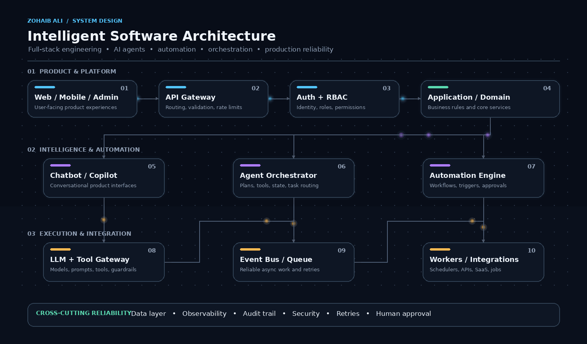

<!-- ========================================================= -->
<!--                     ZOHAIB ALI PROFILE                      -->
<!-- ========================================================= -->

<div align="center">


<br/>

<a href="https://git.io/typing-svg">
  
</a>

<br/>


<br/><br/>

<code>FULL-STACK DEVELOPMENT</code>
&nbsp;•&nbsp;
<code>AI INTEGRATION</code>
&nbsp;•&nbsp;
<code>AUTOMATION</code>
&nbsp;•&nbsp;
<code>SYSTEM DESIGN</code>

</div>

---

## 👋 About Me

I'm **Zohaib Ali**, a **Full-Stack Developer at Parix.ai**.

My academic background is **BS Computer Science at the University of Sindh**.

I work across frontend, backend, APIs, databases, integrations, automation, and AI-enabled software. My focus is on building systems that are **clean, maintainable, scalable, observable, and reliable in real-world use**.

I especially enjoy software where product engineering, AI, automation, and business workflows need to work together as one system.

```javascript
const zohaib = {
  role: "Full-Stack Developer",
  company: "Parix.ai",

  education: {
    degree: "BS Computer Science",
    university: "University of Sindh"
  },

  focus: [
    "Full-Stack Product Engineering",
    "Backend & API Architecture",
    "AI Integrations",
    "Workflow Automation",
    "Agentic Systems",
    "Reliable Software Design"
  ],

  principle: "Build clean. Build reliable. Keep improving."
};
```

---

## 💼 Experience

<table>
  <tr>
    <td width="18%" align="center" valign="middle">
      <strong>💻 CURRENT</strong>
    </td>

    <td width="82%" valign="top">

<h3>Full-Stack Developer — Parix.ai</h3>

<p>
Contributing to real-world software products across modern web development,
backend services, APIs, databases, workflow automation, AI integrations,
debugging, deployment, and production-focused engineering.
</p>

<p>
<code>Frontend</code>
<code>Backend</code>
<code>REST APIs</code>
<code>Databases</code>
<code>AI Integrations</code>
<code>Automation</code>
<code>Debugging</code>
<code>Deployment</code>
</p>

</td>
  </tr>
</table>

---

## 🎓 Education

<table>
  <tr>
    <td width="18%" align="center" valign="middle">
      <strong>🎓 B.S.</strong>
    </td>

    <td width="82%" valign="top">

<h3>BS Computer Science — University of Sindh</h3>

<p>
Academic foundation in programming, software engineering, databases,
algorithms, computer systems, application development, and problem solving.
</p>

</td>
  </tr>
</table>

---

## ⚡ What I Build

| Area | What I Work With |
|---|---|
| 🎨 **Frontend** | Responsive interfaces, dashboards, reusable components, product UI |
| ⚙️ **Backend** | APIs, business logic, authentication, application services |
| 🗄️ **Data** | Relational and document databases, schemas, data flows |
| 🔗 **Integrations** | REST APIs, third-party services, webhooks, external systems |
| 🤖 **AI** | LLM integrations, AI features, chatbots, copilots, tool calling |
| 🧠 **Agents** | Agentic workflows, task execution, orchestration patterns |
| 🔄 **Automation** | Business workflows, background jobs, event-driven processes |
| ☁️ **Production** | Deployment, observability, reliability, performance, cloud systems |

---

## 🧰 Technology Stack

<div align="center">

<h3>Frontend</h3>


<br/><br/>

<h3>Backend & APIs</h3>


<br/><br/>

<h3>Databases</h3>


<br/><br/>

<h3>Development & Infrastructure</h3>


</div>

---

## 🚀 Current Development Focus

<table>

<tr>

<td width="33%" valign="top">

<h3>⚡ Product Engineering</h3>

<sub>
Full-stack applications<br/>
SaaS products<br/>
Dashboards & internal tools
</sub>

</td>

<td width="33%" valign="top">

<h3>🏗️ Backend Systems</h3>

<sub>
API architecture<br/>
Node.js & FastAPI<br/>
Scalable application services
</sub>

</td>

<td width="33%" valign="top">

<h3>🤖 Intelligent Software</h3>

<sub>
AI integrations<br/>
Chatbots & copilots<br/>
LLM-powered functionality
</sub>

</td>

</tr>

<tr>

<td width="33%" valign="top">

<h3>🔄 Automation</h3>

<sub>
Workflow automation<br/>
Event-driven processes<br/>
Background jobs
</sub>

</td>

<td width="33%" valign="top">

<h3>🧠 Orchestration</h3>

<sub>
AI agents<br/>
Tool calling<br/>
Multi-step workflows
</sub>

</td>

<td width="33%" valign="top">

<h3>☁️ Production Systems</h3>

<sub>
Deployment<br/>
Observability<br/>
Reliability & performance
</sub>

</td>

</tr>

</table>

---

## 🏗️ Projects & Real-World Development

<table>

<tr>

<td width="50%" valign="top">

<h3>⚡ Electricity Detection System</h3>

<p>
Contributing to a real-world software system involving application
functionality, backend development, data handling, and practical
business requirements.
</p>

</td>

<td width="50%" valign="top">

<h3>🐾 Veterinary Store Software</h3>

<p>
Working on veterinary business software involving operational workflows,
inventory-related functionality, application logic, and real-world
store requirements.
</p>

</td>

</tr>

<tr>

<td width="50%" valign="top">

<h3>💬 AJAX Chat Application</h3>

<p>
Web communication using frontend and backend technologies.
</p>

<p>
<code>PHP</code>
<code>AJAX</code>
<code>JavaScript</code>
</p>

</td>

<td width="50%" valign="top">

<h3>📝 Blog Management System</h3>

<p>
Content management application implementing CRUD functionality,
database operations, and web application fundamentals.
</p>

<p>
<code>PHP</code>
<code>Database</code>
<code>CRUD</code>
</p>

</td>

</tr>

<tr>

<td width="50%" valign="top">

<h3>🌐 Portfolio Development</h3>

<p>
Frontend-focused development showcasing responsive interfaces,
modern layouts, and web development skills.
</p>

<p>
<code>JavaScript</code>
<code>HTML</code>
<code>CSS</code>
</p>

</td>

<td width="50%" valign="top">

<h3>🚀 More in Progress</h3>

<p>
Continuously working on stronger full-stack, automation,
AI-enabled, and production-oriented software projects.
</p>

</td>

</tr>

</table>

---

## 🤖 AI + Software Engineering

I'm particularly interested in software where **traditional product engineering, AI, agents, automation, and reliable infrastructure** work together as one system.

<div align="center">



<br/><br/>

<code>FULL STACK</code>
&nbsp;•&nbsp;
<code>CHATBOTS</code>
&nbsp;•&nbsp;
<code>AI AGENTS</code>
&nbsp;•&nbsp;
<code>AUTOMATION</code>
&nbsp;•&nbsp;
<code>ORCHESTRATION</code>
&nbsp;•&nbsp;
<code>RELIABILITY</code>

</div>

<br/>

This architecture represents the kind of system design I want to keep improving toward:

**Product Layer** — web applications, mobile applications, admin panels, dashboards, and user-facing experiences.

**Platform Layer** — API gateway, authentication, RBAC, application services, domain services, and business logic.

**AI Layer** — chatbot and copilot experiences, LLM gateways, tool calling, AI agents, context handling, and intelligent features.

**Orchestration Layer** — agent coordination, task routing, multi-step execution, workflow state, tool selection, and business process control.

**Automation Layer** — workflow automation, event-driven processing, queues, workers, schedulers, background jobs, and external triggers.

**Data Layer** — application databases, cache, search systems, vector data, object storage, and external data sources.

**Integration Layer** — third-party APIs, SaaS platforms, webhooks, internal services, and external business systems.

**Reliability Layer** — monitoring, observability, security, audit trails, retries, failure recovery, logging, and human approval where appropriate.

The goal is not to add AI everywhere.

The goal is to make the system **more capable without making it unpredictable, difficult to maintain, or fragile**.

---

## 🧠 How I Think About Software

<table>

<tr>

<td width="18%" align="center" valign="top">

<h3>01</h3>

<strong>Understand</strong>

<br/><br/>

<sub>
Users<br/>
Business problem<br/>
Constraints
</sub>

</td>

<td width="3%" align="center" valign="middle">

<strong>→</strong>

</td>

<td width="18%" align="center" valign="top">

<h3>02</h3>

<strong>Design</strong>

<br/><br/>

<sub>
Architecture<br/>
Data model<br/>
System boundaries
</sub>

</td>

<td width="3%" align="center" valign="middle">

<strong>→</strong>

</td>

<td width="18%" align="center" valign="top">

<h3>03</h3>

<strong>Build</strong>

<br/><br/>

<sub>
Frontend<br/>
Backend<br/>
Integrations
</sub>

</td>

<td width="3%" align="center" valign="middle">

<strong>→</strong>

</td>

<td width="18%" align="center" valign="top">

<h3>04</h3>

<strong>Validate</strong>

<br/><br/>

<sub>
Testing<br/>
Security<br/>
Failure cases
</sub>

</td>

<td width="3%" align="center" valign="middle">

<strong>→</strong>

</td>

<td width="18%" align="center" valign="top">

<h3>05</h3>

<strong>Improve</strong>

<br/><br/>

<sub>
Observe<br/>
Measure<br/>
Optimize
</sub>

</td>

</tr>

</table>

<br/>

<div align="center">

<code>RELIABILITY</code>
&nbsp;•&nbsp;
<code>SECURITY</code>
&nbsp;•&nbsp;
<code>OBSERVABILITY</code>
&nbsp;•&nbsp;
<code>PERFORMANCE</code>
&nbsp;•&nbsp;
<code>MAINTAINABILITY</code>

<br/><br/>

<strong>
Build the simplest system that solves the real problem —
then evolve the architecture when the evidence requires it.
</strong>

</div>

---

## 🌱 Always Improving

<table>

<tr>

<td width="33%" valign="top">

<h3>🏛️ Architecture</h3>

<sub>
System design<br/>
Service boundaries<br/>
Scalability & trade-offs
</sub>

</td>

<td width="33%" valign="top">

<h3>⚙️ Backend Engineering</h3>

<sub>
Advanced APIs<br/>
Distributed workflows<br/>
Reliable data flows
</sub>

</td>

<td width="33%" valign="top">

<h3>🗄️ Data Systems</h3>

<sub>
PostgreSQL<br/>
Caching strategies<br/>
Vector & search systems
</sub>

</td>

</tr>

<tr>

<td width="33%" valign="top">

<h3>🧠 AI Engineering</h3>

<sub>
LLM integration<br/>
AI agents<br/>
Tool & function calling
</sub>

</td>

<td width="33%" valign="top">

<h3>🔄 Automation</h3>

<sub>
Workflow engines<br/>
Queues & workers<br/>
Event-driven systems
</sub>

</td>

<td width="33%" valign="top">

<h3>☁️ Production Engineering</h3>

<sub>
Cloud infrastructure<br/>
Observability<br/>
Performance & reliability
</sub>

</td>

</tr>

</table>

<br/>

<div align="center">

<sub>
Learning deeply enough to understand not only
<strong>how</strong> something works,
but <strong>when it should be used</strong>.
</sub>

</div>

---

## 📊 GitHub Activity

<div align="center">

<a href="https://github.com/zohaibali123-tech?tab=repositories">
  
</a>

<a href="https://github.com/zohaibali123-tech">
  
</a>

<br/><br/>

<sub>
Explore my repositories, contributions, and recent development activity directly on GitHub.
</sub>

</div>

---

## ⚙️ Developer Philosophy

<div align="center">

<h3>Don't add complexity because you can.</h3>

<h3>Add structure because the system needs it.</h3>

<br/>

<strong>
Understand → Design → Build → Validate → Observe → Improve
</strong>

<br/><br/>

Clean code matters.

<br/>

Reliable architecture matters more.

<br/>

Software solving the actual problem matters most.

</div>

---

## 🤝 Connect With Me

<div align="center">

<a href="https://github.com/zohaibali123-tech">
  
</a>

<a href="https://parix.ai">
  
</a>

</div>

<br/>

---

<div align="center">


<br/>

<h3>Thanks for visiting 👋</h3>

</div>


